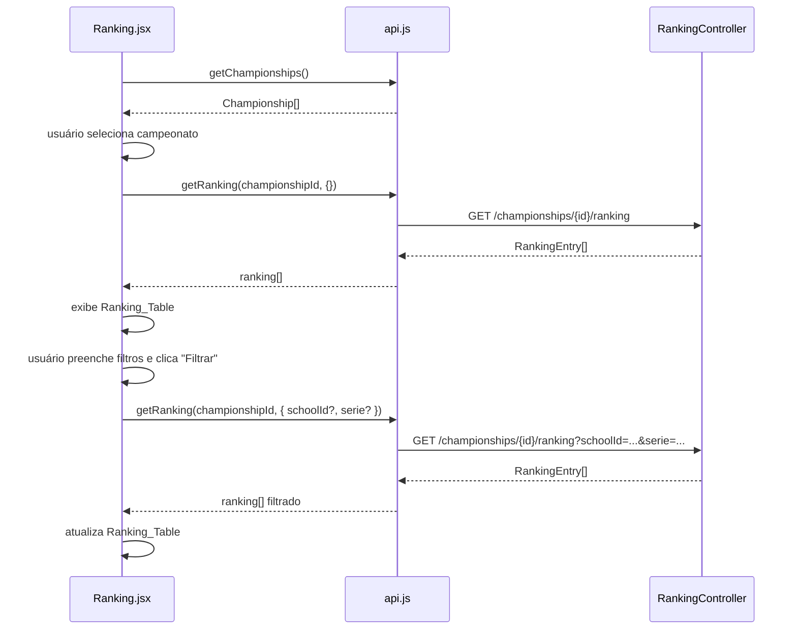
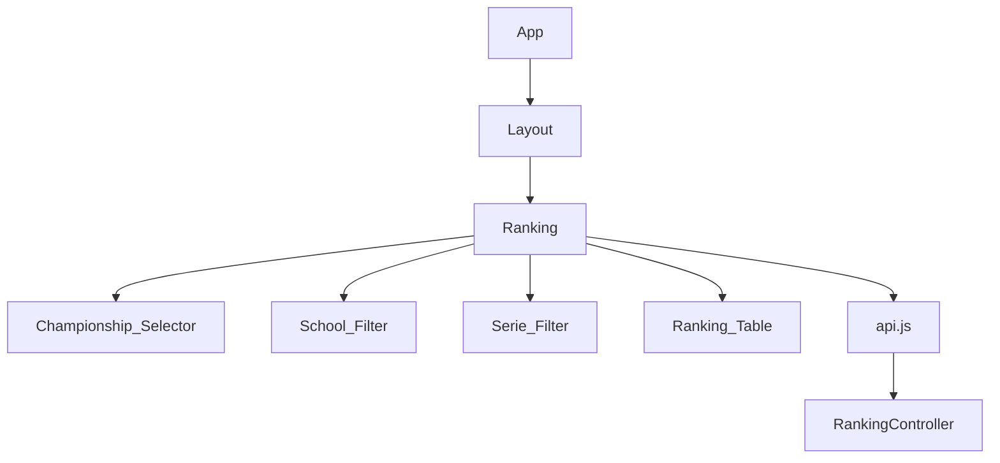

# Design Document — ranking-screen

## Overview

Esta feature cria uma página standalone de Ranking no ScoreCast, acessível via `/ranking` pelo menu lateral. A mudança é exclusivamente de frontend: o backend (`RankingController`, `RankingService`) já suporta todos os filtros necessários e não será alterado.

O `Ranking.jsx` segue o mesmo padrão estrutural de `Students.jsx` e `Predictions.jsx`: seletor de campeonato no topo, filtros condicionais após a seleção, e tabela de resultados. A lógica de filtros (School_Filter + Serie_Filter + botão "Filtrar") é idêntica à já implementada em `RankingTab.jsx`, que é reutilizada como referência direta. O `RankingTab.jsx` existente não é alterado.

Além da nova página, são necessárias duas alterações pontuais: adicionar o item "Ranking" ao array `links` do `Layout.jsx` e registrar a rota `/ranking` no `App.jsx`.

## Architecture





## Components and Interfaces

### `Layout.jsx` — adicionar item de menu

Adicionar entrada ao array `links`:

```js
import { BarChart2 } from 'lucide-react'

// no array links:
{ to: '/ranking', label: 'Ranking', icon: BarChart2 },
```

O item deve ser inserido após "Palpites" e antes de "Gerenciamento", seguindo a ordem lógica de navegação.

### `App.jsx` — registrar rota

```jsx
import Ranking from './pages/Ranking'

// dentro de <Route element={<Layout />}>:
<Route path="/ranking" element={<Ranking />} />
```

### `api.js` — nenhuma alteração necessária

A função `getRanking` já existe e já suporta `params` opcionais com construção de query string:

```js
getRanking: (championshipId, params = {}) => {
  const qs = new URLSearchParams(params).toString()
  return req(`/championships/${championshipId}/ranking${qs ? `?${qs}` : ''}`)
},
```

### `Ranking.jsx` — novo componente

Estado interno:

| Estado | Tipo | Descrição |
|---|---|---|
| `championships` | `array` | Lista de campeonatos carregada no mount |
| `schools` | `array` | Lista de escolas carregada ao selecionar campeonato |
| `ranking` | `array` | Entradas do ranking retornadas pela API |
| `championshipId` | `string` | ID do campeonato selecionado (vazio = nenhum) |
| `schoolId` | `string` | Valor do School_Filter (vazio = "Todas") |
| `serie` | `string` | Valor do Serie_Filter (vazio = sem filtro) |
| `error` | `string` | Mensagem de erro para exibição ao usuário |

Funções principais:

```jsx
// Carrega campeonatos no mount
useEffect(() => {
  api.getChampionships().then(setChampionships).catch((e) => setError(e.message))
}, [])

// Ao selecionar campeonato: reseta filtros, carrega escolas e ranking
async function onChampionshipChange(val) {
  setChampionshipId(val)
  setRanking([])
  setSchoolId('')
  setSerie('')
  setError('')
  try {
    const [r, sc] = await Promise.all([api.getRanking(val, {}), api.getSchools()])
    setRanking(r)
    setSchools(sc)
  } catch (e) { setError(e.message) }
}

// Ao clicar "Filtrar": constrói params e chama getRanking
function handleFilter(e) {
  e.preventDefault()
  const params = {}
  if (schoolId) params.schoolId = schoolId
  if (serie.trim()) params.serie = serie.trim()
  api.getRanking(championshipId, params).then(setRanking).catch((e) => setError(e.message))
}
```

Estrutura JSX resumida:

```jsx
<div className="space-y-6">
  <h1 className="text-2xl font-bold">Ranking</h1>

  {/* Championship_Selector */}
  <Select value={championshipId} onValueChange={onChampionshipChange}>...</Select>

  {error && <p className="text-sm text-red-600">{error}</p>}

  {championshipId && (
    <>
      {/* Filtros: School_Filter + Serie_Filter + botão Filtrar */}
      <form onSubmit={handleFilter} className="flex flex-wrap gap-3 items-end max-w-xl">
        <Select value={schoolId} onValueChange={setSchoolId}>
          <SelectItem value="">Todas</SelectItem>
          {schools.map(...)}
        </Select>
        <Input placeholder="Ex: 9A" value={serie} onChange={...} />
        <Button type="submit">Filtrar</Button>
      </form>

      {/* Ranking_Table */}
      <table>
        <thead>
          <tr><th>#</th><th>Aluno</th><th>Escola</th><th>Série</th><th>Pontos</th></tr>
        </thead>
        <tbody>
          {ranking.length === 0
            ? <tr><td colSpan={5}>Sem dados.</td></tr>
            : ranking.map((r, i) => (
                <tr key={r.studentId}>
                  <td>{i + 1}</td>
                  <td>{r.studentName}</td>
                  <td>{r.schoolName}</td>
                  <td>{r.serie}</td>
                  <td>{r.totalPoints}</td>
                </tr>
              ))
          }
        </tbody>
      </table>
    </>
  )}
</div>
```

## Data Models

Nenhum modelo de dados novo. O frontend consome o DTO existente:

```ts
// RankingEntryResponse (Java record — sem alteração)
{
  studentId:   UUID    // identificador do aluno
  studentName: string  // nome do aluno
  schoolId:    UUID    // identificador da escola
  schoolName:  string  // nome da escola
  serie:       string  // série do aluno
  totalPoints: number  // total de pontos acumulados
}
```

O campo de colocação (`#`) não vem da API — é calculado no frontend como `index + 1` a partir da posição na lista retornada, que já vem ordenada pelo backend (pontos decrescentes, nome ascendente em empate).

Modelos auxiliares já existentes consumidos pela página:

```ts
// Championship
{ id: UUID, name: string }

// School
{ id: UUID, name: string }
```

## Correctness Properties

*A property is a characteristic or behavior that should hold true across all valid executions of a system — essentially, a formal statement about what the system should do. Properties serve as the bridge between human-readable specifications and machine-verifiable correctness guarantees.*

### Property 1: Campeonatos carregados aparecem no Championship_Selector

*For any* lista de campeonatos retornada por `api.getChampionships()`, o `Championship_Selector` renderizado deve conter exatamente uma opção para cada campeonato da lista, na mesma ordem.

**Validates: Requirements 1.3, 2.1**

### Property 2: Seleção de campeonato dispara getRanking com o ID correto

*For any* campeonato selecionado no `Championship_Selector`, a função `api.getRanking` deve ser chamada com o `championshipId` correspondente ao campeonato selecionado e sem parâmetros de filtro adicionais.

**Validates: Requirements 2.2**

### Property 3: Troca de campeonato reseta os filtros ativos

*For any* estado de filtros ativos (qualquer combinação de `schoolId` e `serie` preenchidos), ao selecionar um campeonato diferente no `Championship_Selector`, os filtros `schoolId` e `serie` devem ser resetados para seus valores vazios e `api.getRanking` deve ser chamado sem parâmetros de filtro.

**Validates: Requirements 2.3**

### Property 4: School_Filter sempre exibe "Todas" como primeira opção

*For any* lista de escolas retornada por `api.getSchools()`, o `School_Filter` renderizado deve ter "Todas" como primeiro item, seguido de todas as escolas da lista na ordem recebida.

**Validates: Requirements 3.1**

### Property 5: Construção de query string pelo API client

*For any* combinação de parâmetros opcionais `{ schoolId?, serie? }` passada a `getRanking(championshipId, params)`, a URL construída deve conter na query string exatamente os parâmetros fornecidos (não-vazios) e nenhum parâmetro ausente ou vazio.

**Validates: Requirements 3.3, 3.4, 3.5, 3.6**

### Property 6: Ranking_Table renderiza cada linha corretamente

*For any* lista de `RankingEntry` retornada pela API, a `Ranking_Table` deve exibir exatamente `N` linhas de dados (onde `N = ranking.length`), com cada linha `i` exibindo colocação `i + 1`, `studentName`, `schoolName`, `serie` e `totalPoints` correspondentes à entrada `ranking[i]`, na mesma ordem do array.

**Validates: Requirements 4.2, 4.3, 4.5**

## Error Handling

Nenhum novo caso de erro é introduzido. O tratamento segue o padrão existente nas demais páginas:

- Falha em `api.getChampionships()` no mount: `catch` captura e chama `setError(e.message)`, exibindo a mensagem em vermelho abaixo do seletor (Requirement 1.4).
- Falha em `api.getRanking()` ao selecionar campeonato ou ao filtrar: mesmo padrão de `catch` → `setError(e.message)` (Requirement 2.4).
- Falha em `api.getSchools()`: tratada no mesmo `Promise.all` de `onChampionshipChange`, exibindo erro via `setError`.
- Lista de ranking vazia: não é um erro — a `Ranking_Table` exibe "Sem dados." (Requirement 4.4).
- Nenhum campeonato selecionado: a `Ranking_Table` e os filtros ficam ocultos; nenhuma chamada à API de ranking é realizada (Requirement 2.5).

## Testing Strategy

### Abordagem dual

A feature combina testes de exemplo (casos concretos e edge cases) com testes baseados em propriedades (cobertura ampla de inputs variados).

### Testes de propriedade (Property-Based Testing)

Biblioteca: **[fast-check](https://fast-check.dev/)** com **Vitest** (já adotados no projeto).

Cada teste de propriedade deve rodar no mínimo **100 iterações**.

Tag de referência: `Feature: ranking-screen, Property {N}: {texto}`

| Propriedade | O que varia | O que verifica |
|---|---|---|
| Property 1 | Listas de campeonatos de tamanhos e conteúdos variados | Todas as opções presentes no seletor, na ordem correta |
| Property 2 | IDs de campeonato aleatórios (UUID) | `api.getRanking` chamado com o ID correto e sem filtros |
| Property 3 | Estados aleatórios de filtros (schoolId UUID ou vazio, serie string ou vazia) | Filtros resetados, `api.getRanking` chamado sem params |
| Property 4 | Listas de escolas de tamanhos e conteúdos variados | "Todas" sempre primeiro, escolas na ordem recebida |
| Property 5 | Combinações de `{ schoolId?, serie? }` (presentes ou ausentes) | URL contém exatamente os params fornecidos |
| Property 6 | Listas de `RankingEntry` de tamanhos e valores variados | Colocação = índice+1, dados corretos por linha, ordem preservada |

### Testes de exemplo (Unit)

- Renderizar `Ranking.jsx` sem selecionar campeonato → `Ranking_Table` não está presente e `api.getRanking` não foi chamado (Requirement 2.5).
- Selecionar campeonato → `School_Filter` e `Serie_Filter` ficam visíveis (Requirement 3.2).
- Renderizar `Ranking_Table` com lista vazia → mensagem "Sem dados." presente (Requirement 4.4).
- Renderizar `Ranking_Table` com dados → cabeçalhos `#`, `Aluno`, `Escola`, `Série`, `Pontos` presentes (Requirement 4.1).
- Falha em `api.getChampionships()` → mensagem de erro exibida (Requirement 1.4).
- Falha em `api.getRanking()` → mensagem de erro exibida (Requirement 2.4).
- `Layout.jsx` renderizado → NavLink com `to="/ranking"` e label "Ranking" presente (Requirement 1.1).

### Testes de regressão (Smoke)

- `RankingTab.jsx` não importa nada de `Ranking.jsx` (isolamento de estado — Requirement 5.1).
- `RankingController.java` e `RankingService.java` não são modificados (Requirements 5.2, 5.3).
