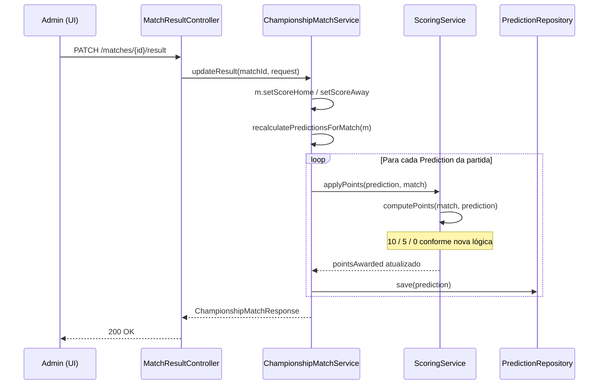
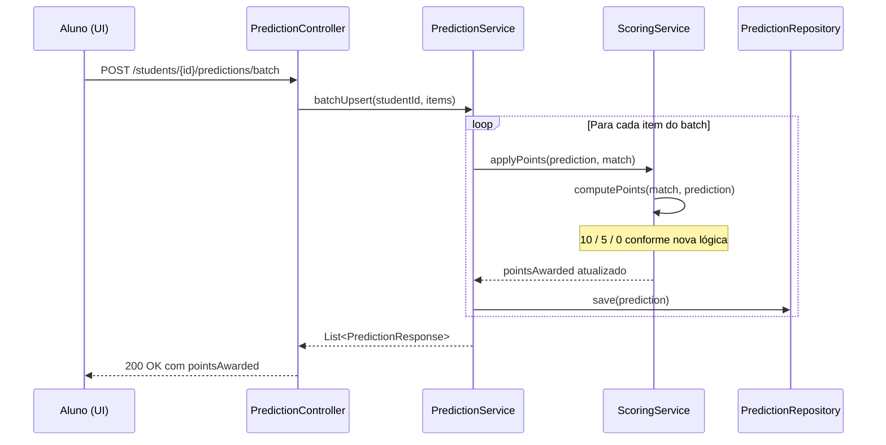
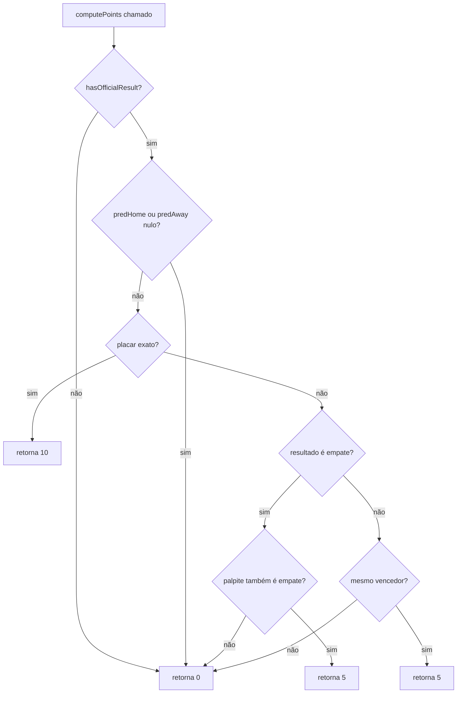

# Design Document — scoring-refactor

## Overview

Esta feature refatora a lógica de pontuação do `ScoringService` no ScoreCast, substituindo a escala binária MVP (0 ou 1 ponto) por uma escala granular de três níveis: **10 pontos** para placar exato, **5 pontos** para acerto do vencedor (ou do empate) com placar errado, e **0 pontos** para erro do vencedor.

A mudança é cirúrgica e centralizada: apenas `ScoringService.computePoints()` é alterado. Toda a orquestração existente — `PredictionService` chamando `scoringService.applyPoints()` ao salvar palpites, e `ChampionshipMatchService.recalculatePredictionsForMatch()` ao atualizar resultados — permanece intacta. O `RankingService` não precisa de nenhuma alteração, pois já agrega os `pointsAwarded` persistidos pelo `ScoringService`.

O frontend (`Predictions.jsx`, `RankingTab.jsx`) exibe os valores de `pointsAwarded` e `totalPoints` diretamente da API, sem lógica de pontuação própria, portanto adapta-se automaticamente à nova escala.

## Architecture







## Components and Interfaces

### Backend

**`ScoringService.computePoints()`** — único método alterado:

```java
public int computePoints(ChampionshipMatch match, Prediction prediction) {
    if (!match.hasOfficialResult()) {
        return 0;
    }
    if (prediction.getPredHome() == null || prediction.getPredAway() == null) {
        return 0;
    }

    int sh = match.getScoreHome(), sa = match.getScoreAway();
    int ph = prediction.getPredHome(), pa = prediction.getPredAway();

    // Placar exato
    if (ph == sh && pa == sa) {
        return 10;
    }

    // Acerto do vencedor ou do empate
    int resultSign = Integer.signum(sh - sa);
    int predSign   = Integer.signum(ph - pa);
    if (resultSign == predSign) {
        return 5;
    }

    return 0;
}
```

A lógica de empate é tratada naturalmente pelo `Integer.signum`: quando `sh == sa`, `resultSign == 0`; quando `ph == pa`, `predSign == 0`. Se ambos forem 0 e o placar não for exato, retorna 5 (empate correto com placar errado). Se apenas um for 0, retorna 0 (um acertou empate, o outro não).

**`ScoringService.applyPoints()`** — sem alteração de assinatura:

```java
public void applyPoints(Prediction prediction, ChampionshipMatch match) {
    prediction.setPointsAwarded(computePoints(match, prediction));
}
```

**`ChampionshipMatchService`** — sem alteração. O método `recalculatePredictionsForMatch()` já itera todos os palpites e chama `scoringService.applyPoints()`.

**`PredictionService`** — sem alteração. Já chama `scoringService.applyPoints()` em `upsert()` e `batchUpsert()`.

**`RankingService`** — sem alteração. Já agrega `pointsAwarded` via `predictionRepository.sumPointsByStudentId()`.

### Frontend

Nenhuma alteração necessária. Os componentes `Predictions.jsx` e `RankingTab.jsx` já exibem `pointsAwarded` e `totalPoints` diretamente dos valores retornados pela API, sem lógica de pontuação própria.

## Data Models

Nenhum modelo de dados alterado. Os campos existentes já suportam a nova lógica:

**`Prediction`**:
- `predHome: Integer` — gols previstos para o time da casa (nullable)
- `predAway: Integer` — gols previstos para o time visitante (nullable)
- `pointsAwarded: int` — pontos atribuídos pelo `ScoringService` (0, 5 ou 10 após a refatoração)

**`ChampionshipMatch`**:
- `scoreHome: Integer` — gols oficiais do time da casa (nullable — ausente = sem resultado)
- `scoreAway: Integer` — gols oficiais do time visitante (nullable — ausente = sem resultado)
- `hasOfficialResult(): boolean` — `scoreHome != null && scoreAway != null`

**Tabela de pontuação resultante:**

| Situação | Pontos |
|---|---|
| Placar exato (com ou sem vencedor) | 10 |
| Vencedor correto, placar errado | 5 |
| Empate correto, placar errado | 5 |
| Vencedor errado | 0 |
| Palpite de empate quando há vencedor | 0 |
| Palpite com vencedor quando é empate | 0 |
| Sem resultado oficial | 0 |
| Palpite incompleto (null) | 0 |

## Correctness Properties

*A property is a characteristic or behavior that should hold true across all valid executions of a system — essentially, a formal statement about what the system should do. Properties serve as the bridge between human-readable specifications and machine-verifiable correctness guarantees.*

### Property 1: Placar exato sempre retorna 10 pontos

*For any* partida com resultado oficial (com ou sem vencedor) e qualquer palpite cujos valores `predHome` e `predAway` sejam iguais a `scoreHome` e `scoreAway` respectivamente, `ScoringService.computePoints()` deve retornar exatamente 10.

**Validates: Requirements 1.1, 2.1**

### Property 2: Acerto do vencedor ou do empate com placar errado retorna 5 pontos

*For any* partida com resultado oficial e qualquer palpite que acerta o vencedor (ou o empate) mas erra o placar exato — ou seja, `signum(predHome - predAway) == signum(scoreHome - scoreAway)` e o placar não é exato — `ScoringService.computePoints()` deve retornar exatamente 5.

**Validates: Requirements 1.2, 2.2**

### Property 3: Resultado errado sempre retorna 0 pontos

*For any* partida com resultado oficial e qualquer palpite que erra o vencedor — ou seja, `signum(predHome - predAway) != signum(scoreHome - scoreAway)` — `ScoringService.computePoints()` deve retornar exatamente 0.

**Validates: Requirements 1.3, 1.4, 2.3**

### Property 4: Ausência de resultado oficial sempre retorna 0 pontos

*For any* partida sem resultado oficial (`scoreHome` ou `scoreAway` nulos) e qualquer palpite (completo ou não), `ScoringService.computePoints()` deve retornar exatamente 0.

**Validates: Requirements 3.1, 5.1**

### Property 5: Palpite incompleto sempre retorna 0 pontos

*For any* partida com resultado oficial e qualquer palpite com `predHome` ou `predAway` nulos, `ScoringService.computePoints()` deve retornar exatamente 0.

**Validates: Requirements 3.2**

### Property 6: Recálculo em massa aplica a nova lógica a todos os palpites

*For any* partida com N palpites associados, após chamar `ChampionshipMatchService.updateResult()`, o `pointsAwarded` de cada palpite deve ser igual ao valor que `ScoringService.computePoints()` retornaria para aquele palpite com o novo resultado.

**Validates: Requirements 4.1, 4.2**

### Property 7: PredictionService delega pontuação ao ScoringService

*For any* palpite salvo via `PredictionService.batchUpsert()` ou `PredictionService.upsert()`, o `pointsAwarded` persistido deve ser igual ao valor que `ScoringService.computePoints()` retornaria para aquele palpite com o resultado atual da partida.

**Validates: Requirements 5.2**

## Error Handling

Nenhum novo caso de erro é introduzido. A refatoração é interna ao `ScoringService`:

- **Placares negativos**: já rejeitados por `ChampionshipMatchService.updateResult()` (`BadRequestException` se `scoreHome < 0 || scoreAway < 0`) e por `PredictionService` (`BadRequestException` se `predHome < 0 || predAway < 0`). O `ScoringService` recebe apenas valores válidos.
- **Palpite incompleto** (`predHome` ou `predAway` nulos): tratado explicitamente — retorna 0 (Property 5). Não lança exceção.
- **Partida sem resultado**: tratado explicitamente via `hasOfficialResult()` — retorna 0 (Property 4). Não lança exceção.
- **Overflow aritmético**: placares são `Integer` (não negativos por validação upstream); `predHome - predAway` não pode causar overflow com valores de placar de futebol realistas. `Integer.signum()` é seguro para qualquer `int`.

## Testing Strategy

### Abordagem dual

A feature combina testes baseados em propriedades (cobertura ampla da lógica de pontuação) com testes de exemplo (casos concretos e integração).

### Testes de propriedade (Property-Based Testing)

Biblioteca: **[jqwik](https://jqwik.net/)** para o backend Java 21 / JUnit 5.

Cada teste de propriedade deve rodar no mínimo **100 iterações**.

Tag de referência: `Feature: scoring-refactor, Property {N}: {texto}`

| Propriedade | Camada | O que varia | O que verifica |
|---|---|---|---|
| Property 1 | Backend (ScoringService) | Placares exatos gerados aleatoriamente (com e sem vencedor) | computePoints == 10 |
| Property 2 | Backend (ScoringService) | Placares com vencedor/empate correto mas placar errado | computePoints == 5 |
| Property 3 | Backend (ScoringService) | Placares com vencedor errado | computePoints == 0 |
| Property 4 | Backend (ScoringService) | Qualquer palpite, partida sem resultado | computePoints == 0 |
| Property 5 | Backend (ScoringService) | Qualquer resultado, palpite com null | computePoints == 0 |
| Property 6 | Backend (ChampionshipMatchService) | N palpites aleatórios por partida | pointsAwarded == computePoints após updateResult |
| Property 7 | Backend (PredictionService) | Palpites e resultados aleatórios | pointsAwarded persistido == computePoints |

**Estratégia de geração para Property 2** (caso mais complexo):

Para gerar palpites que acertam o vencedor mas erram o placar, o gerador deve:
1. Gerar `(sh, sa)` com `sh != sa` (partida com vencedor)
2. Gerar `(ph, pa)` tal que `signum(ph - pa) == signum(sh - sa)` e `(ph, pa) != (sh, sa)`

Para empate correto com placar errado:
1. Gerar `n` para `sh = sa = n`
2. Gerar `m != n` para `ph = pa = m`

### Testes de exemplo (Unit)

- `computePoints` com placar `2x1` e palpite `2x1` → 10
- `computePoints` com placar `2x1` e palpite `3x1` → 5 (mesmo vencedor)
- `computePoints` com placar `2x1` e palpite `1x2` → 0 (vencedor errado)
- `computePoints` com placar `2x1` e palpite `1x1` → 0 (palpite de empate)
- `computePoints` com placar `1x1` e palpite `1x1` → 10 (empate exato)
- `computePoints` com placar `1x1` e palpite `0x0` → 5 (empate correto, placar errado)
- `computePoints` com placar `1x1` e palpite `2x1` → 0 (palpite com vencedor)
- `computePoints` sem resultado oficial → 0
- `computePoints` com palpite nulo → 0
- Ranking soma `pointsAwarded` persistidos sem recalcular (Requirement 4.3)

### Testes de regressão

O comportamento de todos os outros serviços (`ChampionshipMatchService`, `PredictionService`, `RankingService`) deve continuar funcionando sem alteração — cobertos pelos testes existentes. A única mudança observável externamente é que `pointsAwarded` passa a assumir os valores 0, 5 ou 10 em vez de 0 ou 1.
