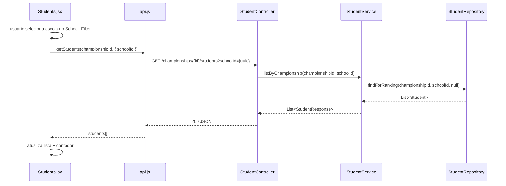

# Design Document — student-school-filter

## Overview

Esta feature adiciona um filtro opcional por escola na listagem de alunos do ScoreCast. A mudança é mínima e cirúrgica: o backend expõe um `@RequestParam(required = false) UUID schoolId` no endpoint existente, reutilizando a query `findForRanking` já presente no `StudentRepository`; o frontend adiciona um `Select` de escola acima da lista em `Students.jsx`, seguindo o padrão já adotado em `RankingTab.jsx`.

O filtro é estritamente opcional — sem `schoolId`, o comportamento é idêntico ao atual. Nenhuma regra de negócio existente (criação, edição, exclusão de alunos) é alterada.

## Architecture



O fluxo sem `schoolId` é idêntico, apenas `schoolId = null` é passado para o repositório, que já trata `null` como "sem filtro".

## Components and Interfaces

### Backend

**`StudentController.list()`** — adicionar `@RequestParam`:

```java
@GetMapping
public List<StudentResponse> list(
        @PathVariable UUID championshipId,
        @RequestParam(required = false) UUID schoolId
) {
    return studentService.listByChampionship(championshipId, schoolId);
}
```

**`StudentService.listByChampionship()`** — aceitar e repassar `schoolId`:

```java
@Transactional(readOnly = true)
public List<StudentResponse> listByChampionship(UUID championshipId, UUID schoolId) {
    championshipService.require(championshipId);
    return studentRepository.findForRanking(championshipId, schoolId, null)
            .stream().map(this::toResponse).toList();
}
```

A query `findForRanking` já trata `schoolId = null` como ausência de filtro via `(:schoolId IS NULL OR s.school.id = :schoolId)`. O parâmetro `serie` é passado como `null` para manter a semântica de "sem filtro de série".

**`StudentRepository`** — nenhuma alteração necessária. A query existente já suporta o caso de uso.

### Frontend

**`api.js`** — atualizar `getStudents` para aceitar `params` opcionais:

```js
getStudents: (championshipId, params = {}) => {
  const qs = new URLSearchParams(params).toString()
  return req(`/championships/${championshipId}/students${qs ? `?${qs}` : ''}`)
},
```

Segue o mesmo padrão de `getRanking`.

**`Students.jsx`** — adicionar estado `filterSchoolId` separado do `schoolId` do formulário de criação, e o componente `School_Filter`:

- `filterSchoolId` — estado do filtro ativo (string vazia = "Todas")
- `schoolId` — estado do formulário de criação (sem alteração)
- Função `loadStudents(params)` — centraliza a chamada `api.getStudents` com os params atuais
- `Select` de escola com opção "Todas" posicionado acima da lista
- Todas as operações CRUD chamam `loadStudents({ schoolId: filterSchoolId || undefined })` após concluir

## Data Models

Nenhum modelo de dados novo. Os modelos existentes já suportam a feature:

- `Student` — já possui `school` (FK para `School`) e `championship` (FK para `Championship`)
- `StudentResponse` — já inclui `schoolId` e `schoolName`
- `StudentRequest` / `StudentUpdateRequest` — sem alteração

A query JPQL existente no repositório:

```sql
SELECT s FROM Student s
WHERE s.championship.id = :championshipId
AND (:schoolId IS NULL OR s.school.id = :schoolId)
AND (:serie IS NULL OR s.serie = :serie)
ORDER BY s.name ASC
```

Ao chamar com `serie = null`, o filtro de série é ignorado, tornando a query equivalente a um `findByChampionshipIdAndOptionalSchoolIdOrderByNameAsc`.

## Correctness Properties

*A property is a characteristic or behavior that should hold true across all valid executions of a system — essentially, a formal statement about what the system should do. Properties serve as the bridge between human-readable specifications and machine-verifiable correctness guarantees.*

### Property 1: Listagem sem filtro retorna todos os alunos do campeonato ordenados por nome

*For any* campeonato com N alunos cadastrados, chamar `listByChampionship(championshipId, null)` deve retornar exatamente N alunos, todos pertencentes ao campeonato, ordenados por nome em ordem ascendente (case-insensitive).

**Validates: Requirements 1.1, 3.2**

### Property 2: Filtro por escola retorna apenas alunos daquela escola

*For any* campeonato com alunos de múltiplas escolas, chamar `listByChampionship(championshipId, schoolId)` deve retornar apenas alunos cuja `school.id` seja igual ao `schoolId` fornecido, ordenados por nome ascendente.

**Validates: Requirements 1.2**

### Property 3: Construção de query string pelo API client

*For any* `schoolId` UUID fornecido como parâmetro, a função `getStudents(championshipId, { schoolId })` deve construir uma URL contendo `schoolId=<uuid>` na query string. Quando nenhum `schoolId` é fornecido, a URL não deve conter nenhum query param.

**Validates: Requirements 2.6**

### Property 4: Contador de alunos reflete o tamanho da lista filtrada

*For any* lista de alunos retornada pela API (com ou sem filtro), o contador exibido na `Students_Page` deve ser sempre igual ao `students.length` da lista atual.

**Validates: Requirements 2.5**

### Property 5: Operações CRUD preservam o filtro ativo

*For any* escola selecionada no `School_Filter` e qualquer operação CRUD (criar, atualizar, excluir aluno), a recarga da lista após a operação deve chamar `api.getStudents` com o mesmo `filterSchoolId` que estava ativo antes da operação.

**Validates: Requirements 3.3**

### Property 6: School_Filter sempre exibe "Todas" como primeira opção

*For any* lista de escolas retornada por `api.getSchools()`, o `School_Filter` renderizado deve ter "Todas" como primeiro item, seguido de todas as escolas da lista na ordem recebida.

**Validates: Requirements 2.4**

## Error Handling

Nenhum novo caso de erro é introduzido. O comportamento de erro segue os padrões existentes:

- `schoolId` inválido (UUID malformado): Spring converte automaticamente — retorna `400 Bad Request` via `MethodArgumentTypeMismatchException` (comportamento padrão do Spring MVC).
- `schoolId` válido mas sem alunos correspondentes: retorna `200 OK` com lista vazia (Requirement 1.3).
- `championshipId` inexistente: `championshipService.require()` lança `NotFoundException` → `404 Not Found` (comportamento existente preservado).
- Falha na chamada à API no frontend: o `catch` existente em cada handler já captura e exibe o erro via `setError(e.message)`.

## Testing Strategy

### Abordagem dual

A feature combina testes de exemplo (casos concretos e edge cases) com testes baseados em propriedades (cobertura ampla de inputs variados).

### Testes de propriedade (Property-Based Testing)

Biblioteca recomendada: **[jqwik](https://jqwik.net/)** para o backend Java 21 / JUnit 5. Para o frontend React, **[fast-check](https://fast-check.dev/)** com Vitest.

Cada teste de propriedade deve rodar no mínimo **100 iterações**.

Tag de referência: `Feature: student-school-filter, Property {N}: {texto}`

| Propriedade | Camada | O que varia | O que verifica |
|---|---|---|---|
| Property 1 | Backend (Service/Repo) | Campeonatos e alunos gerados aleatoriamente | Todos os alunos retornados, ordenação ASC |
| Property 2 | Backend (Service/Repo) | Alunos de múltiplas escolas, schoolId aleatório | Apenas alunos da escola filtrada, ordenação ASC |
| Property 3 | Frontend (api.js) | UUIDs aleatórios como schoolId | URL construída corretamente |
| Property 4 | Frontend (Students.jsx) | Listas de alunos de tamanhos variados | Contador == students.length |
| Property 5 | Frontend (Students.jsx) | Escola selecionada + operação CRUD | api.getStudents chamado com filterSchoolId correto |
| Property 6 | Frontend (Students.jsx) | Listas de escolas de tamanhos variados | "Todas" sempre primeiro |

### Testes de exemplo (Unit/Integration)

- **Backend**: `GET /students` sem `schoolId` retorna todos os alunos (regressão); `GET /students?schoolId=<uuid-sem-alunos>` retorna `[]` com HTTP 200 (Requirement 1.3).
- **Frontend**: Selecionar "Todas" chama `api.getStudents` sem params (Requirement 2.3); `School_Filter` aparece quando `championshipId` está selecionado (Requirement 2.1); sem filtro ativo, comportamento idêntico ao anterior (Requirement 3.1).

### Testes de regressão

As operações de CRUD existentes (criar, editar, excluir aluno) devem continuar funcionando sem alteração — cobertos pelos testes existentes sem necessidade de modificação.
